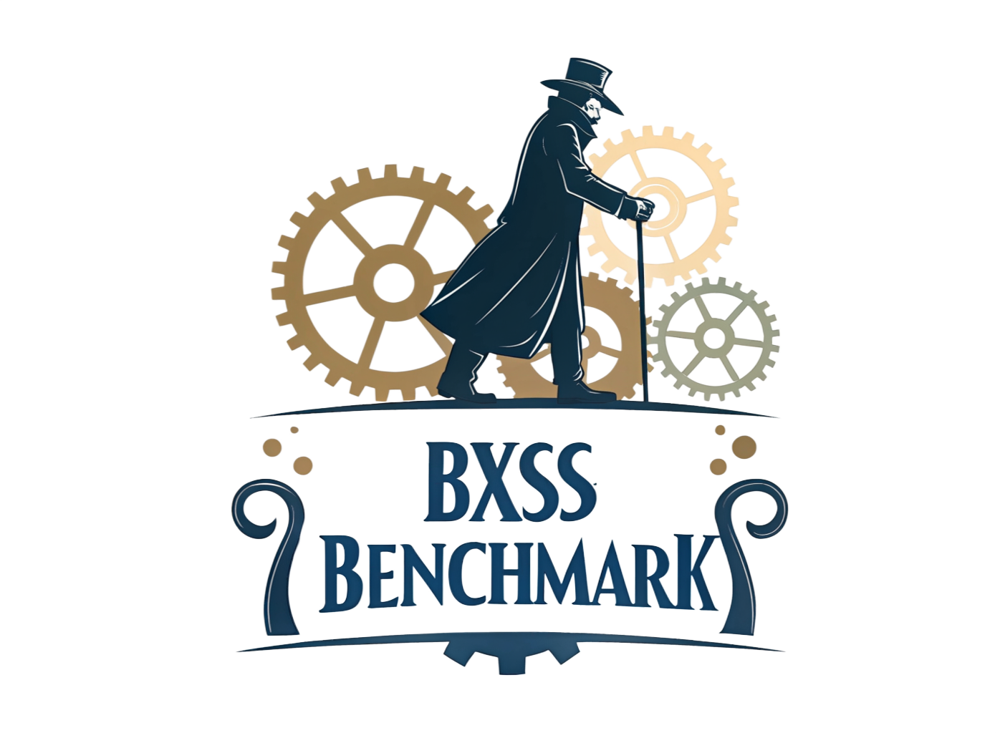

# bXSS Benchmark



## Objective

**bXSS Benchmark** is a web application designed to evaluate and benchmark the effectiveness of blind XSS (Cross-Site Scripting) polyglot payloads against a variety of real-world scenarios. It provides a structured environment for security researchers and developers to test, compare, and analyze payloads in different contexts, helping to improve web application security. It also can be use to train your XSS skills.

As the XSS gym training developed by brutelogic is no longer accessible, this project is a local alternative. I try to integrated his previous scenario as reference, but this integration isn't fully finnished.

It is a side project, do not hesitate to report issues. I will try to fix them as soon as possible !

PS: I would not recommend to expose this app pubicly, no security measures have been deployed and the app is still under development. 

---

## Features

- **Scenario-Based Testing:** Test payloads against a curated set of XSS scenarios.
- **Payload Management:** Add, edit, and manage XSS payloads.
- **Automated and Headless Testing:** Run tests automatically in headless mode.
- **Result Tracking:** View and analyze the effectiveness of payloads.
- **Extensible:** Easily add new scenarios via YAML files.
- **Training:** Practice your xss skills in different contexts.

---

## Installation

### Prerequisites

- [Docker](https://www.docker.com/) (optional, for containerized setup)

### Clone the Repository

```bash
git clone https://github.com/your-org/xss-benchmark.git
cd xss-benchmark
```


## Running the Application

```bash
docker compose up --build
sudo echo 'xsslab_app 127.0.0.1' >> /etc/hosts
```

The application will be available at [http://xsslab_app:9090](http://xsslab_app:9090).

---

## Running Tests

go to webapp, in the home page add your payload and run a benchmark.

Payloads examples:

```html 
Brutelogic bxss
JavaScript://%250Aalert?.(1)// '/*\'/*"/*\"/*`/*\`/*%26apos;)/*<!--> </Title/</Style/</Script/</textArea/</iFrame/</noScript> \74k<K/contentEditable/autoFocus/OnFocus= /*${/*/;{/**/(alert)(1)}//><Base/Href=//X55.is\76-->

Basic bxss
"><svg/onload=eval(atob('YWxlcnQoImJ4c3MiKQ=='))>// 

```

### Manual tests
You want to improve your payload and modify it manually?
1. Go to the Scenarios page
2. Click on the scenario you want to test.
3. In the url add "?payload=" followed by your payload
4. Press enter :)

---

## Adding a New Scenario

1. **Edit the Scenario YAML File**

   Add your new scenario to the main YAML file, e.g. `app/scenarios/TBD/scenarios.yaml`, following the existing format.

2. **Extract Scenario Files**

   Use the provided script to split scenarios into individual YAML files:

   ```bash
   bash scripts/extract_scenarios.sh
   ```

   This will generate scenario files in `app/scenarios/definitions/`.

3. **Verify Scenario Loading**

   The application loads scenarios from the definitions directory at startup or when you click on the button in the scenario web page.

4. **Test Your Scenario**

   - Visit `/scenarios` in the web UI to see your new scenario.
   - Test with different payloads, using the 'payload=' url parameter

---

## Directory Structure

```
app/
  controllers/
  models/
  scenarios/
    definitions/ // scenario defintions are there
    TBD/
  templates/
  static/
  app.py
scripts/
  extract_scenarios.sh
tests/
README.md
requirements.txt
```

---

## Contributing

- Fork the repository and create a feature branch.
- Submit pull requests with clear descriptions.
- Follow PEP8 and project-specific code style.

---

## License

[MIT License](LICENSE)

---

## Contact

For questions or support, please open an issue or contact the maintainer.


## TBD
For js_snippet insert the payload in a custom js file. Because for brutelogic xss gym, there is redundancy
Brutelogic filtered is probably when quote are backslashed
add scenario : script src in head section 